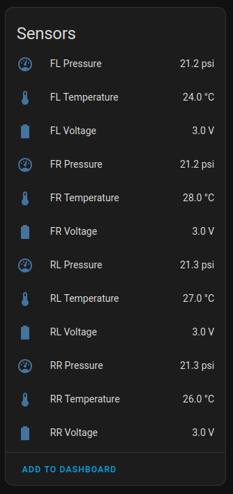

# ESPHome_BLE_TPMS

A lot of research has already been done on BLE TPMS sensors, but it seems to me that there are slight variations of these sensors, with different formats. This is my work with one of these formats.

The sensors I bought from [AliExpress](https://www.aliexpress.com/item/1005004818524799.html) starts with the MAC address "AC:15:85" and shows up with the name "BR" with a BLE scanning app. They are meant to be used with the SYTPMS mobile app. They Advertise a service as "0x27a5" with an empty payload. The manufacturer id and manufacturer data seems to contain the actual data we're interested in

We can get this data with the following snippet:
```
esp32_ble_tracker:
  on_ble_advertise:
    - mac_address: "AC:15:85:xx:xx:xx"
      then:
        - lambda: |-
            ESP_LOGD("BLE_TPMS", "TPMS BLE Device discovered");
            for (auto data : x.get_manufacturer_datas()) {
              ESP_LOGD("BLE_TPMS", "Manufacturer ID: %s", data.uuid.to_string().c_str());
              ESP_LOGD("BLE_TPMS", "Manufacturer Data: %X:%X:%X:%X:%X", data.data[0], data.data[1], data.data[2], data.data[3], data.data[4]);
              ESP_LOGD("BLE_TPMS", "Manufacturer Data length: %d", data.data.size());
            }
```

Using the following example: `0x1E00 1A:00:95:A4:79`,

`1E` is the battery voltage (3.0v)

`1A` is the temperature in degree celcius (26 degree)

`00:95` is the pressure (14.9 kPa)


## TPMS firmware in action


## Similar work
1. [TPMS](https://github.com/andi38/TPMS/) by andi38
2. [BLE_TPMS](https://github.com/ra6070/BLE-TPMS) by ra6070
